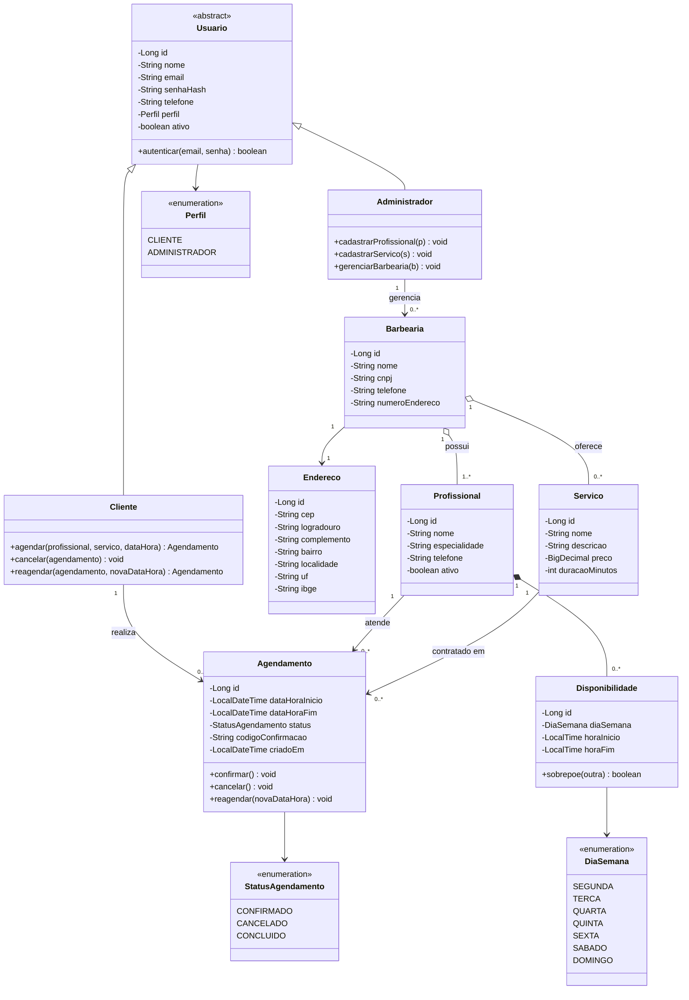

```mermaid
classDiagram
    class Usuario {
        <<abstract>>
        -Long id
        -String nome
        -String email
        -String senhaHash
        -String telefone
        -Perfil perfil
        -boolean ativo
        +autenticar(email, senha) boolean
    }
    class Cliente {
        +agendar(profissional, servico, dataHora) Agendamento
        +cancelar(agendamento) void
        +reagendar(agendamento, novaDataHora) Agendamento
    }
    class Administrador {
        +cadastrarProfissional(p) void
        +cadastrarServico(s) void
        +gerenciarBarbearia(b) void
    }
    class Barbearia {
        -Long id
        -String nome
        -String cnpj
        -String telefone
        -String numeroEndereco
    }
    class Endereco {
        -Long id
        -String cep
        -String logradouro
        -String complemento
        -String bairro
        -String localidade
        -String uf
        -String ibge
    }
    class Profissional {
        -Long id
        -String nome
        -String especialidade
        -String telefone
        -boolean ativo
    }
    class Disponibilidade {
        -Long id
        -DiaSemana diaSemana
        -LocalTime horaInicio
        -LocalTime horaFim
        +sobrepoe(outra) boolean
    }
    class Servico {
        -Long id
        -String nome
        -String descricao
        -BigDecimal preco
        -int duracaoMinutos
    }
    class Agendamento {
        -Long id
        -LocalDateTime dataHoraInicio
        -LocalDateTime dataHoraFim
        -StatusAgendamento status
        -String codigoConfirmacao
        -LocalDateTime criadoEm
        +confirmar() void
        +cancelar() void
        +reagendar(novaDataHora) void
    }
    class Perfil {
        <<enumeration>>
        CLIENTE
        ADMINISTRADOR
    }
    class StatusAgendamento {
        <<enumeration>>
        CONFIRMADO
        CANCELADO
        CONCLUIDO
    }
    class DiaSemana {
        <<enumeration>>
        SEGUNDA
        TERCA
        QUARTA
        QUINTA
        SEXTA
        SABADO
        DOMINGO
    }
    Usuario <|-- Cliente
    Usuario <|-- Administrador
    Usuario --> Perfil
    Administrador "1" --> "0..*" Barbearia : gerencia
    Barbearia "1" --> "1" Endereco
    Barbearia "1" o-- "1..*" Profissional : possui
    Profissional "1" *-- "0..*" Disponibilidade
    Barbearia "1" o-- "0..*" Servico : oferece
    Cliente "1" --> "0..*" Agendamento : realiza
    Profissional "1" --> "0..*" Agendamento : atende
    Servico "1" --> "0..*" Agendamento : contratado em
    Agendamento --> StatusAgendamento
    Disponibilidade --> DiaSemana
```
