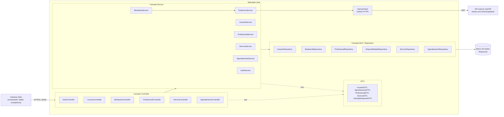

# Diagrama de Componentes

```mermaid
flowchart LR
    UI["Interface Web<br/>(computador, tablet, smartphone)"]
    subgraph API["Aplicação Java"]
        direction TB
        subgraph CTRL["Camada Controller"]
            AuthC[AuthController]
            UsuarioC[UsuarioController]
            BarbeariaC[BarbeariaController]
            ProfC[ProfissionalController]
            ServC[ServicoController]
            AgendC[AgendamentoController]
        end
        subgraph SERV["Camada Service"]
            AuthS[AuthService]
            UsuarioS[UsuarioService]
            BarbeariaS[BarbeariaService]
            ProfS[ProfissionalService]
            ServS[ServicoService]
            AgendS[AgendamentoService]
            CepS[EnderecoService]
        end
        subgraph DTOS["DTO"]
            DTO["UsuarioDTO, AgendamentoDTO,<br/>ProfissionalDTO, ServicoDTO,<br/>ViaCepResponseDTO"]
        end
        subgraph REPO["Camada DAO / Repository"]
            UsuarioR[UsuarioRepository]
            BarbeariaR[BarbeariaRepository]
            ProfR[ProfissionalRepository]
            DispR[DisponibilidadeRepository]
            ServR[ServicoRepository]
            AgendR[AgendamentoRepository]
        end
        VCC["ViaCepClient<br/>(cliente HTTP)"]
    end
    DB[("Banco de Dados<br/>Relacional")]
    VIACEP["API externa ViaCEP<br/>viacep.com.br/ws/{cep}/json"]
    UI -->|HTTPS / JSON| CTRL
    CTRL --> SERV
    CTRL -.usa.-> DTOS
    SERV -.usa.-> DTOS
    SERV --> REPO
    CepS --> VCC
    BarbeariaS --> CepS
    REPO --> DB
    VCC -->|GET| VIACEP
```
