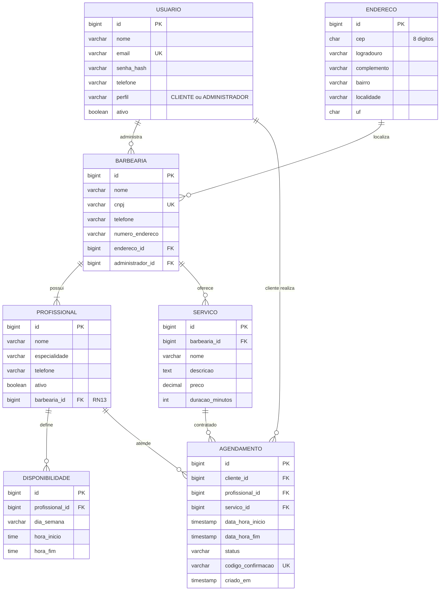

# Modelo do Banco de Dados (DER)

```mermaid
erDiagram
    USUARIO {
        bigint id PK
        varchar nome
        varchar email UK
        varchar senha_hash
        varchar telefone
        varchar perfil "CLIENTE ou ADMINISTRADOR"
        boolean ativo
    }
    ENDERECO {
        bigint id PK
        char cep "8 digitos"
        varchar logradouro
        varchar complemento
        varchar bairro
        varchar localidade
        char uf
    }
    BARBEARIA {
        bigint id PK
        varchar nome
        varchar cnpj UK
        varchar telefone
        varchar numero_endereco
        bigint endereco_id FK
        bigint administrador_id FK
    }
    PROFISSIONAL {
        bigint id PK
        varchar nome
        varchar especialidade
        varchar telefone
        boolean ativo
        bigint barbearia_id FK "RN13"
    }
    DISPONIBILIDADE {
        bigint id PK
        bigint profissional_id FK
        varchar dia_semana
        time hora_inicio
        time hora_fim
    }
    SERVICO {
        bigint id PK
        bigint barbearia_id FK
        varchar nome
        text descricao
        decimal preco
        int duracao_minutos
    }
    AGENDAMENTO {
        bigint id PK
        bigint cliente_id FK
        bigint profissional_id FK
        bigint servico_id FK
        timestamp data_hora_inicio
        timestamp data_hora_fim
        varchar status
        varchar codigo_confirmacao UK
        timestamp criado_em
    }
    USUARIO ||--o{ BARBEARIA : administra
    ENDERECO ||--o{ BARBEARIA : localiza
    BARBEARIA ||--|{ PROFISSIONAL : possui
    BARBEARIA ||--o{ SERVICO : oferece
    PROFISSIONAL ||--o{ DISPONIBILIDADE : define
    USUARIO ||--o{ AGENDAMENTO : "cliente realiza"
    PROFISSIONAL ||--o{ AGENDAMENTO : atende
    SERVICO ||--o{ AGENDAMENTO : contratado
```
